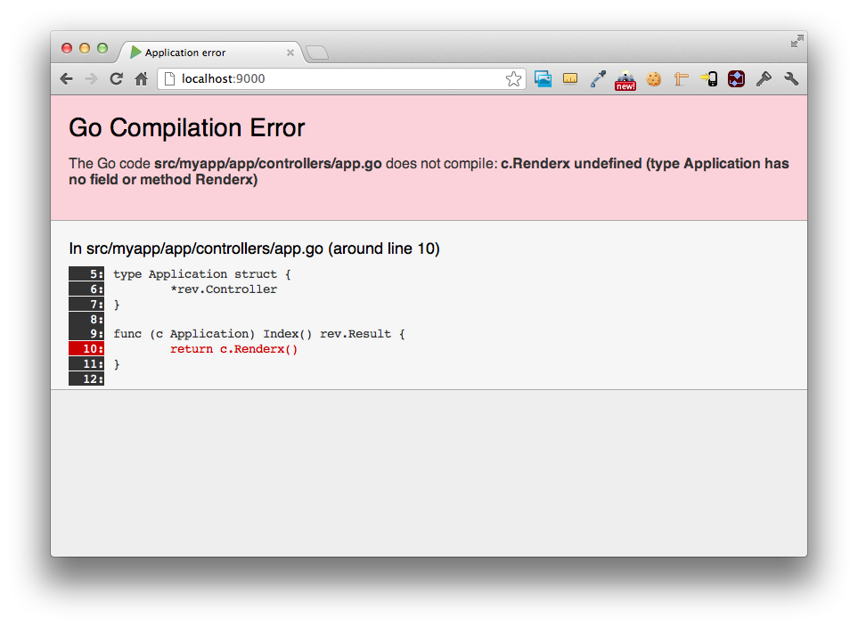

In the [previous article](createapp.html) we created a new Revel application
called **myapp**. In this article we look at how Revel handles the HTTP request
to http://localhost:9000/, resulting in the welcome message.

### Routes

The first thing that Revel does is check the **conf/routes** file -- the
generated routes file contains a route:

	GET     /                                       Application.Index

This tells Revel to invoke the **Index** method of the **Application**
controller when it receives a **GET** request to **/**.

### Actions

Let's follow this call to the code, in **app/controllers/app.go**:

	package controllers

	import "github.com/robfig/revel"

	type Application struct {
		*rev.Controller
	}

	func (c Application) Index() rev.Result {
		return c.Render()
	}

All controllers must be structs that embed `rev.Controller` or `*rev.Controller`
in the first slot (directly or indirectly). Any method on a controller that is
exported and returns a `rev.Result` may be treated as an Action.

The Revel controller provides many useful methods for generating Results.  In
this example, it calls [`Render()`](../docs/godoc/mvc.html#Controller.Render),
which tells Revel to find and render a template as the response (**200 OK**).

### Templates

All templates are kept in the **app/views** directory.  When an explicit
template name is not specified, Revel looks for a template matching the action.
In this case, Revel finds the **app/views/Application/Index.html** file, and
renders it as a [Go template](http://www.golang.org/pkg/html/template).



	{{set . "title" "Home"}}
	{{template "header.html" .}}

	<h1>Your Application Is Ready</h1>

	{{template "footer.html" .}}



Beyond the functions provided by the Go templates, Revel adds
[a few helpful ones](../manual/templates.html) of its own.

This template is very simple.  It:

1. Adds a new **title** variable to the render context.
2. Includes the **header.html** template (which uses the title).
3. Displays a welcome message.
4. Includes the **footer.html**.

If you look at header.html, you can see some more template tags in action:



	<!DOCTYPE html>
	<html>
	  <head>
	    <title>{{.title}}</title>
	    <meta http-equiv="Content-Type" content="text/html; charset=utf-8">
	    <link rel="stylesheet" type="text/css" media="screen" href="/public/stylesheets/main.css">
	    <link rel="shortcut icon" type="image/png" href="/public/images/favicon.png">
	    
	    {{range .moreStyles}}
	      <link rel="stylesheet" type="text/css" href="/public/{{.}}">
	    {{end}}
	    {{range .moreScripts}}
	      
	    {{end}}
	  </head>
	  <body>



You can see the title being set, and you can also see that it accepts JS and CSS
files included from calling templates in the **moreStyles** and **moreScripts**
variables.

### Hot-reload

Let's change the welcome message.  In **Index.html**, change

	<h1>Your Application Is Ready</h1>

to

	<h1>Hello World</h1>

Refresh your browser, and you should see the change immediately!  Revel noticed
that your template changed and reloaded it.

Revel watches:

* All go code under **app/**
* All templates under **app/views/**
* Your routes file: **conf/routes**

Changes to any of those will cause Revel to update your running app with the
newest code.  Try it right now: open **app/controllers/app.go** and introduce
an error.

Change

	return c.Render()

to

	return c.Renderx()

Refresh the page and Revel will display a helpful error message:

Lastly, let's pass some data into the template.

In **app/controllers/app.go**, change:

	return c.Renderx()

to:

	greeting := "Aloha World"
	return c.Render(greeting)

In **app/views/Application/Index.html**, change:



	<h1>Hello World</h1>



to:



	<h1>{{.greeting}}</h1>



Refresh the page and you should see your Hawaiian greeting.

**Next: [Make a simple Hello World application](firstapp.html).**
